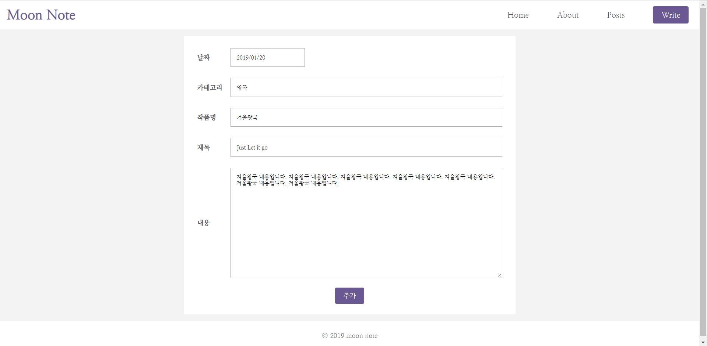

## Moon-note 프로젝트 진행상황

> 날짜 : 2019.01.20 

  

  

#### 오늘 작업한 내용

1. 디자인 적용
2. 기존 CSS로 되어있는 스타일 Sass로 변경
3. 포스트를 수정할 때 수정 전의 데이터가 불려오지 않는 버그 수정
4. 날짜 선택 시 datepicker api 추가

#### 다음에 작업할 내용

1. 포스트 수정 이후에 날짜 형식이 바뀌는 버그
2. 영화 api 추가
3. 수정/생성/삭제 이후 변경 내용 바로 뷰에서 보여주기

아마 다음주쯤에 프로젝트를 마무리할 수 있을 것 같다. 일단은 이정도 기능만 구현되게끔 작업하고 차후 프로젝트에서 이번에 성공하지 못한 기능들을 추가해봐야겠다.