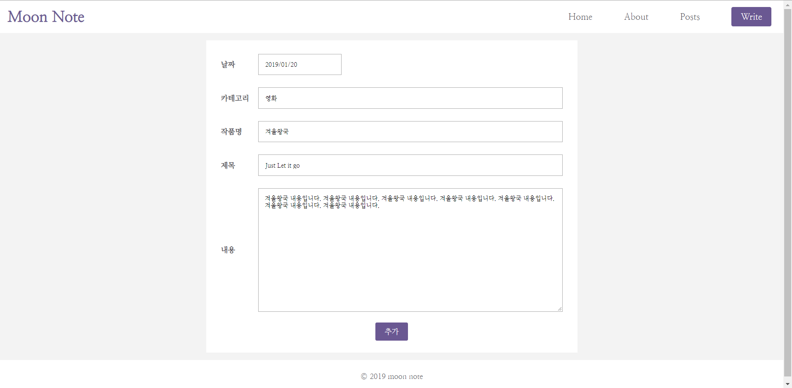

# Moon-note 프로젝트 진행상황 (2)

> 날짜 : 2019.01.24

  

  

#### 오늘 작업한 내용

1. 포스트 수정 이후에 날짜 형식이 바뀌는 버그 수정
2. 프로젝트 마무리

#### 느낀점

이번 프로젝트를 어느 기능까지 구현하면 좋을지 고민을 해봤는데, 초기에 기획했던 오픈 api를 연동해서 주제에 맞는 이미지, 상세정보 등을 연동하는 기능은 지금 실력으로는 기간이 더 늘어질 것 같아 필수적인 버그만 개선하고 마무리했다. 이번에 미처 완성하지 못한 부분은 다음 프로젝트에서 더 보완하여 진행할 예정이다.  

아쉬운 점도 있지만 그래도 이번 기회에 미숙하지만 처음으로 MongoDB를 이용해 백엔드를 접할 수 있었고, 라우터나 폼 같이 지난 프로젝트보다 다양한 리액트의 기능들을 구현해볼 수 있어 좋은 프로젝트였다고 생각한다. 다음에는 더 힘내자! :smiley_cat: 